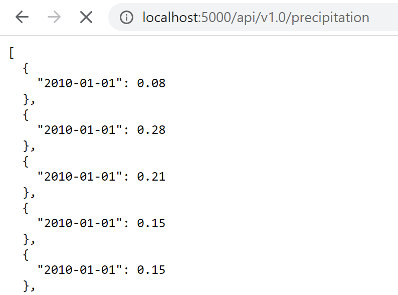

# Hawaii Climate Analysis

## Climate Data Analysis and API creation to search specific data conditions.
###### The purpose of this project is to analyse climate conditions, such as precipitation and temperature, during the last year of the last recorded date within the dataset.

#### Precipitation Analysis

###### A query to retrieve the last 12 months of precipitation data was defined, in order to see the behaviour of this variable against time (Dates):

#### Station Analysis

###### A query to retrieve the last 12 months of temperature observation data (TOBS) was defined, in order to analyze the frecuency of the data, specifically for the most active station (USC00519281):

#### Climate App

###### A Flask API based on the previous queries was built, with the purpose of having an external source to search the data:

